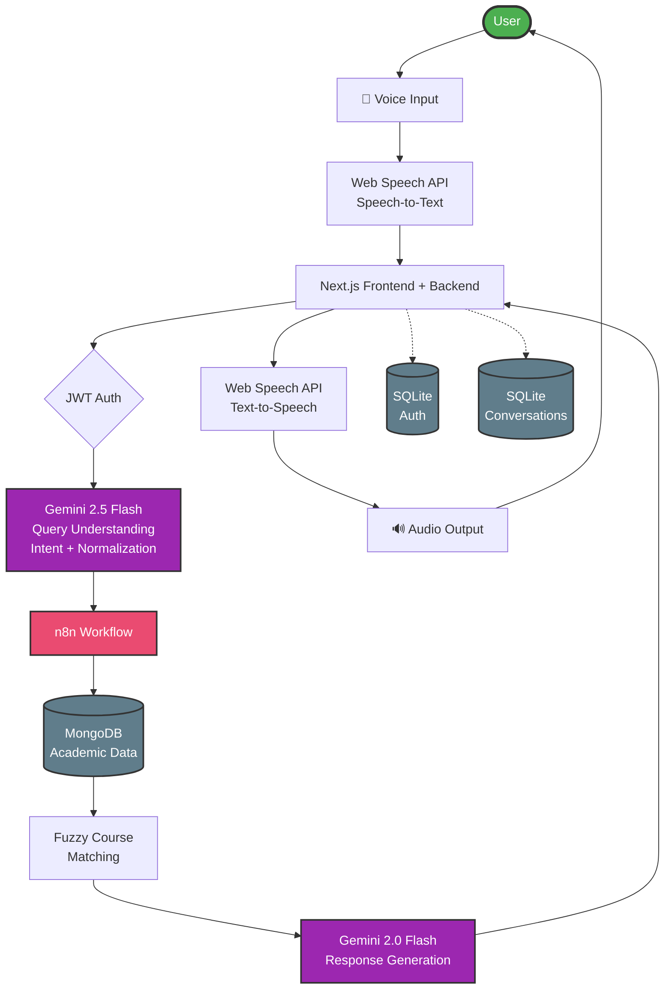

# Voice-Based Academic Assistant - Architecture Diagram

## Mermaid Flowchart (Paste this in Excalidraw)

```mermaid
flowchart TB
    %% User Layer
    User([👤 User])

    %% Input Layer
    VoiceInput[🎤 Voice Input]
    TextInput[⌨️ Text Input]
    WebSpeechSTT[Web Speech API<br/>Speech-to-Text]

    %% Frontend Layer
    NextJSFrontend[Next.js 16 React Frontend<br/>app/dashboard/page.tsx]

    %% Authentication & Session
    AuthCheck{Authenticated?}
    Login[Login/Register<br/>app/api/auth/*/route.ts]
    SQLiteAuth[(SQLite DB<br/>users table)]
    JWTToken[JWT Token<br/>HTTP-only Cookie]

    %% API Layer
    QueryAPI[Query API Endpoint<br/>app/api/voice/query/route.ts]

    %% Preprocessing Layer
    GeminiPreprocess[Gemini 2.5 Flash<br/>Query Understanding<br/>lib/gemini.ts]
    Understanding[Query Understanding:<br/>• Intent Classification<br/>• Normalized Query<br/>• Entity Extraction<br/>• Confidence Score<br/>• Reasoning]

    %% Fallback Layer
    FallbackCheck{Gemini<br/>Available?}
    RegexFallback[Regex Patterns<br/>Semantic Matching]
    KeywordFallback[Basic Keywords]

    %% Context Layer
    ConversationDB[(SQLite DB<br/>conversations table)]
    LastContext[Last Conversation<br/>Context]

    %% n8n Orchestration Layer
    N8NWebhook[n8n Webhook Trigger<br/>receives: query, intent,<br/>rollNumber, context]
    N8NMongoDB[MongoDB Query Node<br/>Find Student Data]
    MongoDBAtlas[(MongoDB Atlas<br/>Academic Data:<br/>CGPA, Courses,<br/>Attendance, Faculty)]

    %% n8n Processing
    FuzzyMatch[JavaScript Code Node<br/>Fuzzy Course Matching<br/>• Substring matching<br/>• Abbreviation expansion]
    IntentRouter{Intent Type?}

    %% Response Generation
    BuildPrompt[Build Context-Aware Prompt<br/>• Student data<br/>• Matched course<br/>• Query intent<br/>• Response style]
    GeminiResponse[Gemini 2.0 Flash<br/>Response Generation<br/>Temp: 0.3]
    N8NResponse[n8n Response Webhook<br/>returns: output]

    %% Response Layer
    SaveConversation[Save to Conversation History]
    ResponsePayload[Response Payload:<br/>• AI Response<br/>• Intent<br/>• Confidence<br/>• Normalized Query<br/>• Reasoning]

    %% Output Layer
    DisplayResponse[Display Response<br/>+ Understanding Feedback]
    WebSpeechTTS[Web Speech API<br/>Text-to-Speech]
    AudioOutput[🔊 Audio Output]

    %% Flow Connections
    User --> VoiceInput
    User --> TextInput
    VoiceInput --> WebSpeechSTT
    WebSpeechSTT --> NextJSFrontend
    TextInput --> NextJSFrontend

    NextJSFrontend --> AuthCheck
    AuthCheck -->|No| Login
    Login --> SQLiteAuth
    SQLiteAuth --> JWTToken
    JWTToken --> NextJSFrontend
    AuthCheck -->|Yes| QueryAPI

    QueryAPI --> ConversationDB
    ConversationDB --> LastContext
    LastContext --> GeminiPreprocess
    QueryAPI --> GeminiPreprocess

    GeminiPreprocess --> FallbackCheck
    FallbackCheck -->|Success| Understanding
    FallbackCheck -->|Failed| RegexFallback
    RegexFallback --> Understanding
    RegexFallback -->|Failed| KeywordFallback
    KeywordFallback --> Understanding

    Understanding --> N8NWebhook

    N8NWebhook --> N8NMongoDB
    N8NMongoDB --> MongoDBAtlas
    MongoDBAtlas --> FuzzyMatch

    FuzzyMatch --> IntentRouter
    IntentRouter -->|CGPA| BuildPrompt
    IntentRouter -->|Attendance| BuildPrompt
    IntentRouter -->|Faculty| BuildPrompt
    IntentRouter -->|Courses| BuildPrompt
    IntentRouter -->|Course Details| BuildPrompt
    IntentRouter -->|General Status| BuildPrompt
    IntentRouter -->|Unknown| BuildPrompt

    BuildPrompt --> GeminiResponse
    GeminiResponse --> N8NResponse
    N8NResponse --> ResponsePayload

    ResponsePayload --> SaveConversation
    SaveConversation --> ConversationDB
    ResponsePayload --> DisplayResponse

    DisplayResponse --> WebSpeechTTS
    WebSpeechTTS --> AudioOutput
    AudioOutput --> User

    %% Styling
    classDef userClass fill:#4CAF50,stroke:#333,stroke-width:3px,color:#fff
    classDef inputClass fill:#2196F3,stroke:#333,stroke-width:2px,color:#fff
    classDef nextjsClass fill:#000000,stroke:#333,stroke-width:2px,color:#fff
    classDef authClass fill:#FF9800,stroke:#333,stroke-width:2px,color:#fff
    classDef aiClass fill:#9C27B0,stroke:#333,stroke-width:3px,color:#fff
    classDef dbClass fill:#607D8B,stroke:#333,stroke-width:2px,color:#fff
    classDef n8nClass fill:#EA4B71,stroke:#333,stroke-width:2px,color:#fff
    classDef outputClass fill:#4CAF50,stroke:#333,stroke-width:2px,color:#fff

    class User userClass
    class VoiceInput,TextInput,WebSpeechSTT,WebSpeechTTS,AudioOutput inputClass
    class NextJSFrontend,QueryAPI nextjsClass
    class AuthCheck,Login,SQLiteAuth,JWTToken authClass
    class GeminiPreprocess,Understanding,GeminiResponse aiClass
    class SQLiteAuth,ConversationDB,MongoDBAtlas dbClass
    class N8NWebhook,N8NMongoDB,FuzzyMatch,IntentRouter,BuildPrompt,N8NResponse n8nClass
    class DisplayResponse,ResponsePayload outputClass
```

## Simplified Version (for presentations)

## Key Components Legend

| Component | Technology | Purpose |
|-----------|-----------|---------|
| 🎤 Voice Input | Browser Microphone | Capture user speech |
| Speech-to-Text | Web Speech API | Convert audio to text |
| Frontend | Next.js 16 + React 19 | User interface |
| Authentication | JWT + bcrypt | Secure login |
| User DB | SQLite | Store credentials |
| Query Understanding | Gemini 2.5 Flash | Semantic intent extraction (zero-keyword) |
| Context DB | SQLite | Conversation history |
| Workflow | n8n | AI orchestration |
| Academic DB | MongoDB Atlas | Student CGPA, attendance, courses |
| Fuzzy Matching | JavaScript | Course abbreviation handling |
| Response Gen | Gemini 2.0 Flash | Voice-optimized answers |
| Text-to-Speech | Web Speech API | Audio output |

## Architecture Highlights

1. **Monolith Design**: Single Next.js 16 application (no separate backend)
2. **Dual Database**: SQLite (auth/history) + MongoDB (academic data)
3. **Two-AI System**:
   - Gemini 2.5 Flash (preprocessing, $0.00003/query)
   - Gemini 2.0 Flash (response generation)
4. **Three-Tier Fallback**: Gemini → Regex → Keywords
5. **Deterministic Workflow**: n8n (not AI Agent) for reliability
6. **Zero-Keyword Understanding**: Natural queries work without exact terms
